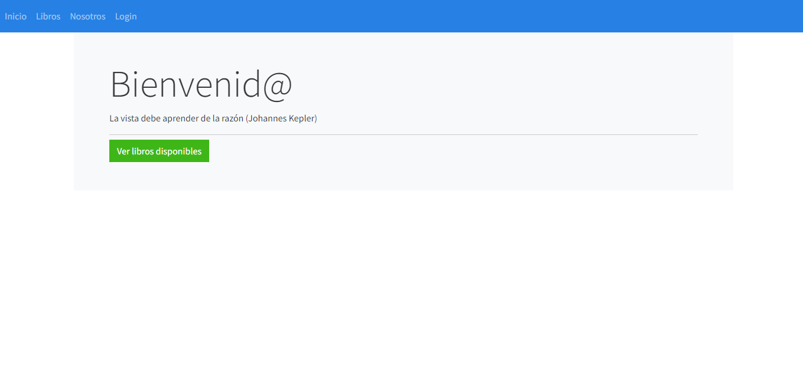
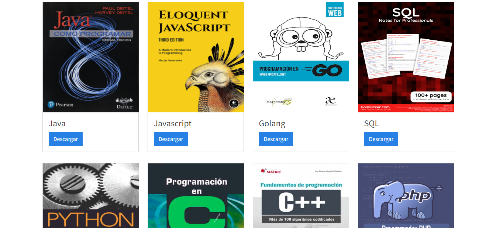
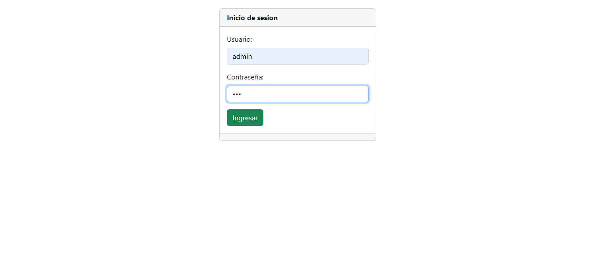
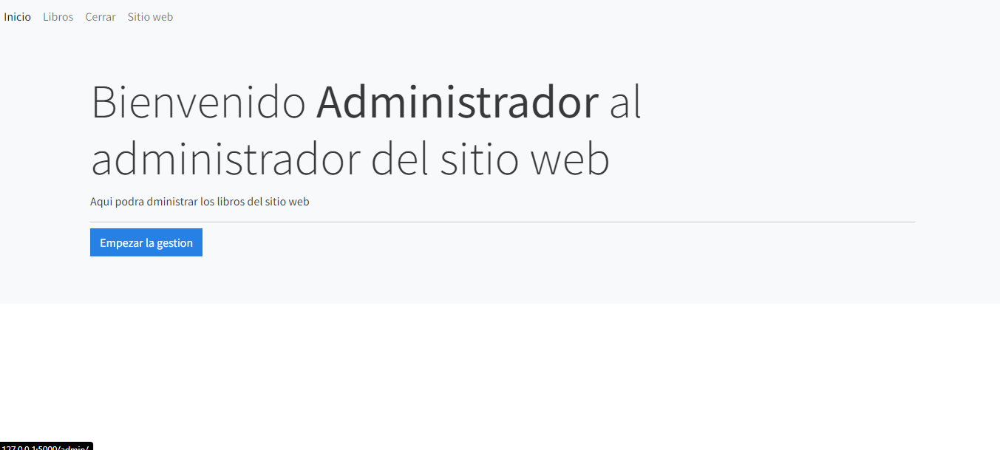
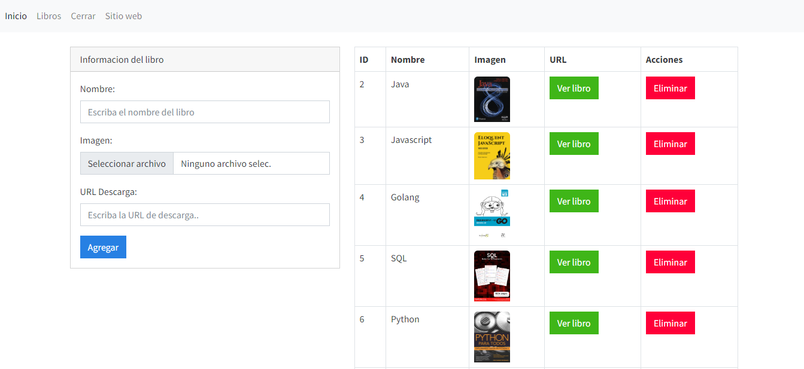

# Sitio web con PYTHON (Flask)


## Instalcion de Flask
Ejecutar el siguiente comando para la instalacion:
**`pip install flask`**
 <br>
Instalacion de **Flask-MySQL**:
**`pip install flask-mysql`**

Esto con el fin de poder conectarnos a una **DB**.


## Estructura del proyecto
Creacion de la carpeta ***templates*** ya que Flask ingresa directamente a esta carpeta por default para buscar templates y estructuras HTML.<br>

Asi mismo se debera de crear una carpeta ***admin*** dentro de la carpeta templates, con el fin de poder administrar el sitio web, para poder subir (imagenes, Imagenes, etc.). <br>

Dentro de templates se debera de crear la carpeta ***sitio*** ya que este servira para poder mostrar la informacion del sitio web. <br>

## Usando Bootstrap

Ejecutando el siguiente comando en el archivo **index.html**:
**``bs5-$``**
Crera una estructura HTML y agregara la libreria automaticamente de Bootstrap.


## Creacion de la aplicacion
Se necesitara crear un archivo **`app.py`** ya que ahi se agregara el codigo en Python para poder iniciar la aplicacion.
 <br>
### Corriendo la aplicacion desdela terminal:
**`python app.py`**

## Estructura de la carpeta **admin**
Se creara los templates para la cabecera y para el pie de pagina.


## Creacion de la DB

Creacion de la db `sitio_libros`:
```sql
CREATE DATABASE sitio_libros;
```
Creacion de la tabla `libros`
```sql
CREATE TABLE `libros` (
  `id` int(11) NOT NULL,
  `nombre` varchar(255) NOT NULL,
  `imagen` varchar(255) NOT NULL,
  `url` varchar(255) NOT NULL
);
```

# Vista

## Inicio

<p aling="center">
    
</p>

## Seccion Libros

<p aling="center">
    
</p>

## Login

<p aling="center">
    
</p>

## Inicio Admin

<p aling="center">
    
</p>

## Seccion Admin Libros

<p aling="center">
    
</p>
